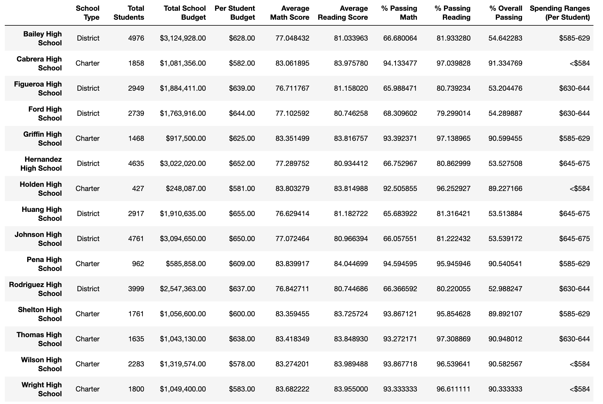

# School_District_Analysis

## Project Overview
### The school board has notified the client and her supervisor that the students_complete.csv file shows evidence of academic dishonesty; specifically, reading and math grades for Thomas High School ninth graders appear to have been altered. Although the school board does not know the full extent of the academic dishonesty, they want to uphold state-testing standards and have turned to you for help. The client has asked you to replace the math and reading scores for Thomas High School with NaNs while keeping the rest of the data intact. It will be summarized how these changes affected the overall analysis.

#### The following Panda analysis of school and student data was used to create:
- A high-level snapshot of the district's key metrics, presented in a table format
- An overview of the key metrics for each school, presented in a table format
- Tables presenting each of the following metrics:
  - Top 5 and bottom 5 performing schools, based on the overall passing rate
  - The average math score received by students in each grade level at each school
  - The average reading score received by students in each grade level at each school
  - School performance based on the budget per student
  - School performance based on the school size 
  - School performance based on the type of school

### Resources
- Data Source: (1) schools_complete.csv; (2) students_complete-csv
- Software: pandas 1.3.4, Jupyter notebook 

## Results
 - How is the district summary affected?
   - The district summary is unchanged after removing 9th grade math and reading scores for students at Thomas High School
   
 - How is the school summary affected?
   - The school summary overall summary was unaffected for all schools except for Thomas High School, because 9th grade math and reading scores were removed. Fours changes will be highlighted in the summary sections of this written analysis.
### Original Summary
  
### New School Summary
  
 - How does replacing the ninth graders’ math and reading scores affect Thomas High School’s performance relative to the other schools?
   - The performance difference is negligible (between 0.0472% - 0.3177%) across all areas.
 - How does replacing the ninth-grade scores affect the following:
   - Math and reading scores by grade
     - Only 9th grade math and reading scores were removed for Thomas High School. 
   - Scores by school spending
     - Spending remains the same, as this value was not changed.
   - Scores by school size
     - School size remains the same, as this value was not changed.
   - Scores by school type
     - School type remains the same, as this value was not changed.
## Summary: 
   - First change: Average Math score decreased from 83.4183% to 83.3509%
   - Second change: % Passing Math decreased from 93.2722% to 93.1857%
   - Third change: % Passing Reading decreased from 97.3089% to 97.0187%
   - Fourth change: % Overall Passing decreased from 90.9480% to 90.6303%
