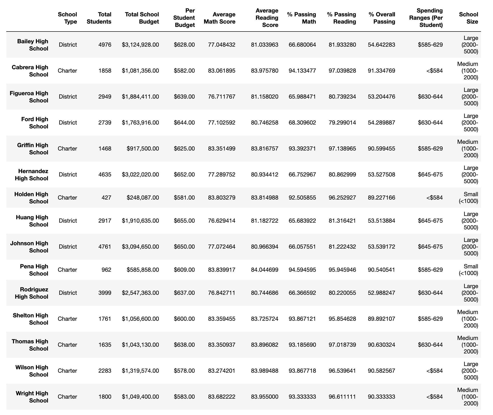

# School_District_Analysis
## Analysis of school and student data using Pandas.
### Overview of the school district analysis: Explain the purpose of this analysis.

## Results: Using bulleted lists and images of DataFrames as support, address the following questions.
 - How is the district summary affected?
   - The district summary is unchanged
   
 - How is the school summary affected?
    
    
 - How does replacing the ninth graders’ math and reading scores affect Thomas High School’s performance relative to the other schools?
 - How does replacing the ninth-grade scores affect the following:
 - Math and reading scores by grade
 - Scores by school spending
 - Scores by school size
 - Scores by school type
## Summary: Summarize four changes in the updated school district analysis after reading and math scores for the ninth grade at Thomas High School have been replaced with NaNs.
